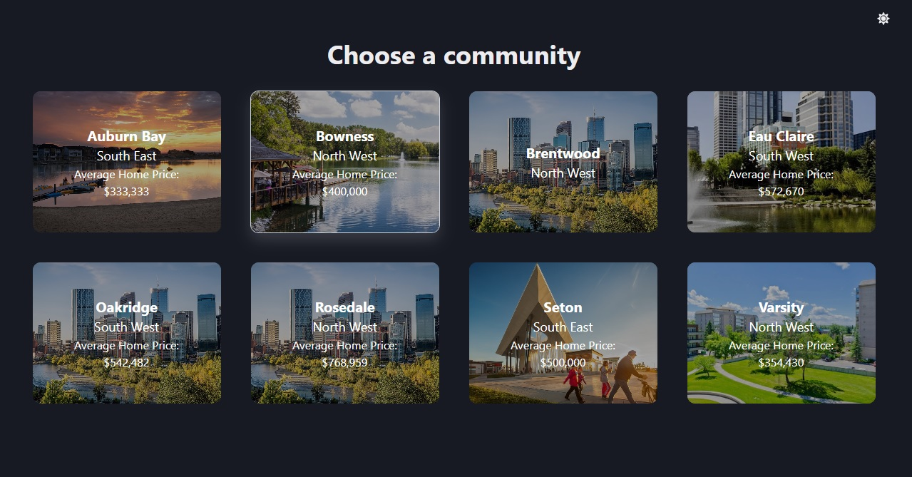
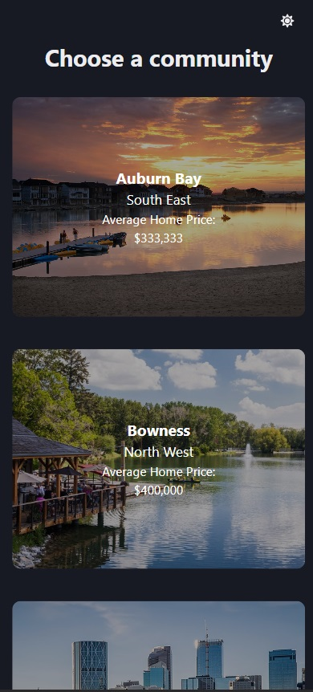
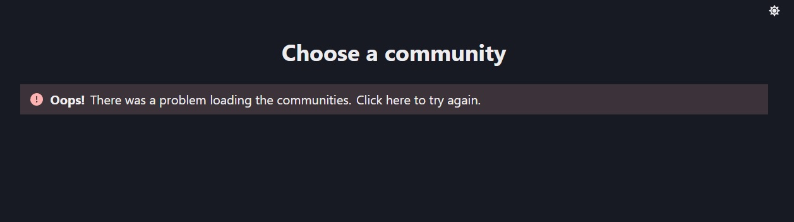

# OpenHouse.AI - Front End Web Development Coding Exercise

## Images

This section provides a visual overview of the application in various states and themes.

### Light Mode

### Dark Mode

### Mobile View

### Loading State

### Error State

### No Communities

## Future Improvements

With more time dedicated to this project, several enhancements could be made to elevate the application's quality and user experience:

1. **Enhanced UI Components**: Focus on refining UI components for a more polished look.

2. **Interactive Community Features**: Expand the functionality to make communities interactable. Introduce features like clickable community names that lead to detailed pages, showing all the homes in the community.

3. **Advanced Data Visualization**: Given more data, implement advanced tools for dynamic data representation. This could involve more detailed statistics about communities, presented in an engaging and easily digestible format.

4. **Map Integration for Communities**: Develop a map view feature for a more immersive user experience. This would allow users to visually explore communities and their corresponding homes, enhancing the interactivity.

# Installation and Setup Instructions

This project was bootstrapped with
[Create React App](https://github.com/facebook/create-react-app).

## Available Scripts

In the project directory, you can run:

### `npm start`

Runs the app in the development mode.  Open
[http://localhost:3000](http://localhost:3000) to view it in the browser.

The page will reload if you make edits.  You will also see any lint errors
in the console.

### `npm test`

Launches the test runner in the interactive watch mode.  See the section
about
[running tests](https://facebook.github.io/create-react-app/docs/running-tests)
for more information.

### `npm run build`

Builds the app for production to the `build` folder.  It correctly bundles
React in production mode and optimizes the build for the best performance.

The build is minified and the filenames include the hashes.  Your app is
ready to be deployed!

See the section about
[deployment](https://facebook.github.io/create-react-app/docs/deployment) for
more information.

### `npm run eject`

**Note: this is a one-way operation. Once you `eject`, you can’t go back!**

If you aren’t satisfied with the build tool and configuration choices, you can
`eject` at any time. This command will remove the single build dependency from
your project.

Instead, it will copy all the configuration files and the transitive
dependencies (webpack, Babel, ESLint, etc) right into your project so you have
full control over them. All of the commands except `eject` will still work, but
they will point to the copied scripts so you can tweak them. At this point
you’re on your own.

You don’t have to ever use `eject`. The curated feature set is suitable for
small and middle deployments, and you shouldn’t feel obligated to use this
feature. However we understand that this tool wouldn’t be useful if you couldn’t
customize it when you are ready for it.

## Learn More

You can learn more in the
[Create React App documentation](https://facebook.github.io/create-react-app/docs/getting-started).

To learn React, check out the [React documentation](https://reactjs.org/).
